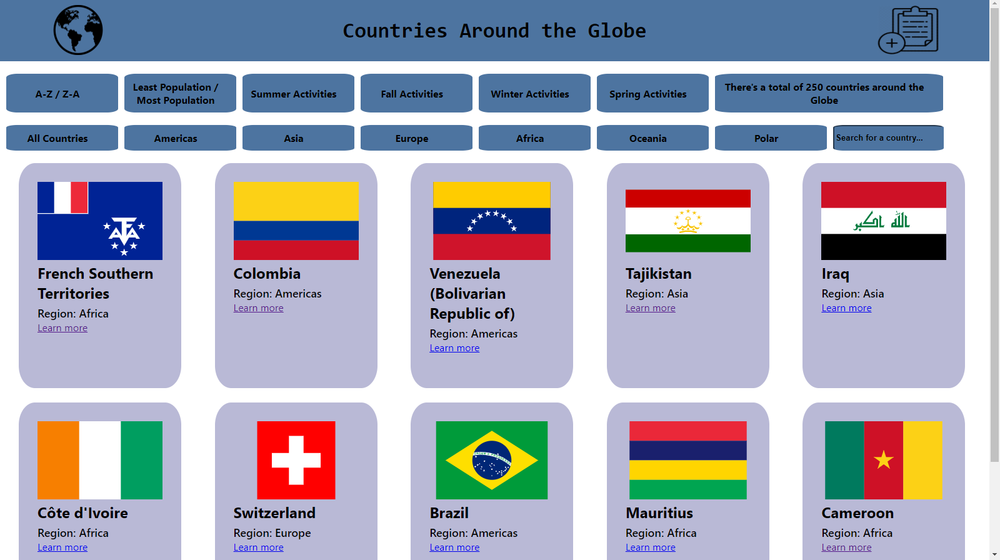

## My Skills:  
✅ JavaScript (ES6)

🔶 Front-End ✅ HTML5 - CSS3 - React - Redux - Tailwind

🔶 Back-End🔩 ✅ Node.js - Express.js - Sequelize ORM - PostgreSQL - MongoDB

## 🚧 Work In Progress 🚧
### Clothing E-Commerce:

https://e-commerce-g6.netlify.app/

## My Projects:
### *Countries Around The World*

<h4>Countries app where you can learn more about each country an add activities to them!!!</h4>

<h5>Learn more:</h5>
https://github.com/FranG14/CountriesAroundTheWorld

<!--
**FranG14/FranG14** is a ✨ _special_ ✨ repository because its `README.md` (this file) appears on your GitHub profile.

Here are some ideas to get you started:

- 🔭 I’m currently working on ...
- 🌱 I’m currently learning ...
- 👯 I’m looking to collaborate on ...
- 🤔 I’m looking for help with ...
- 💬 Ask me about ...
- 📫 How to reach me: ...
- 😄 Pronouns: ...
- ⚡ Fun fact: ...
-->
